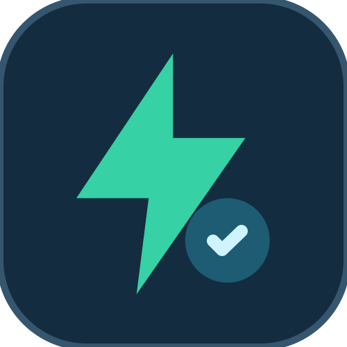
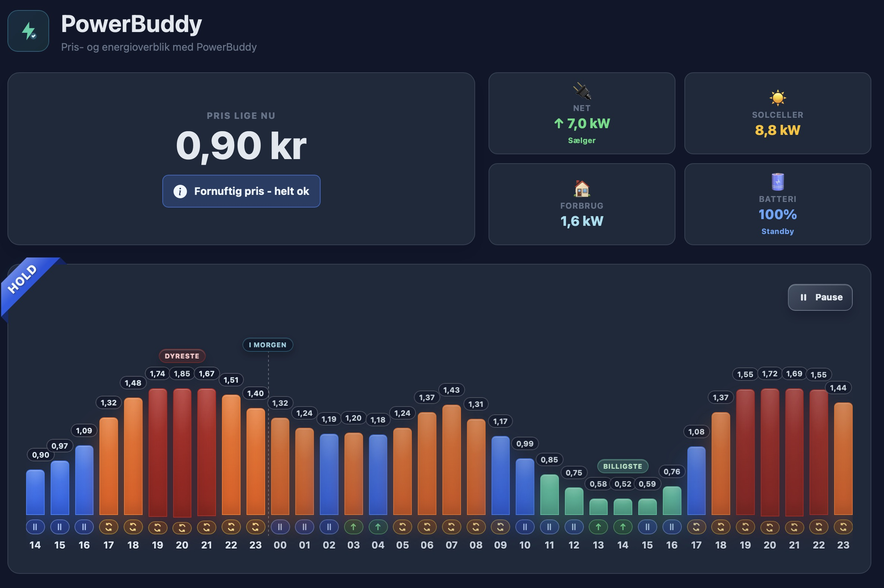
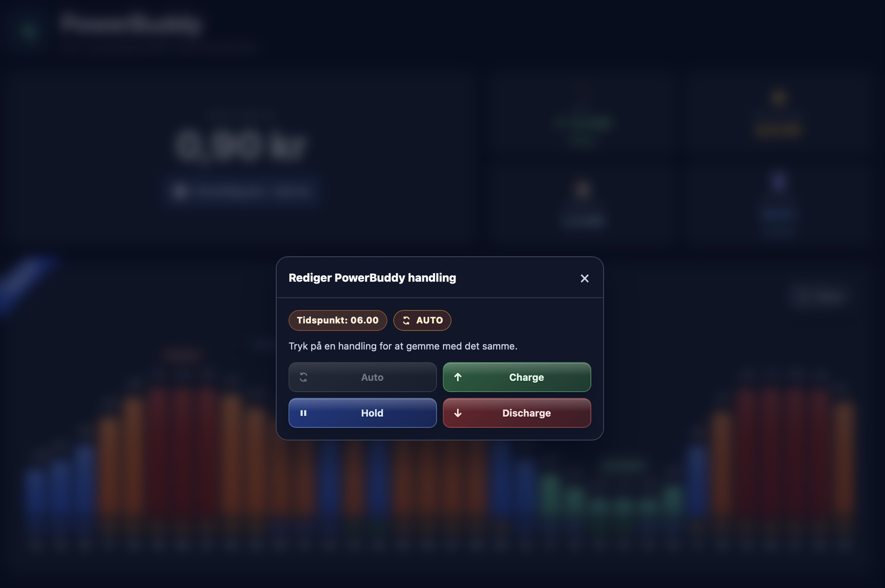
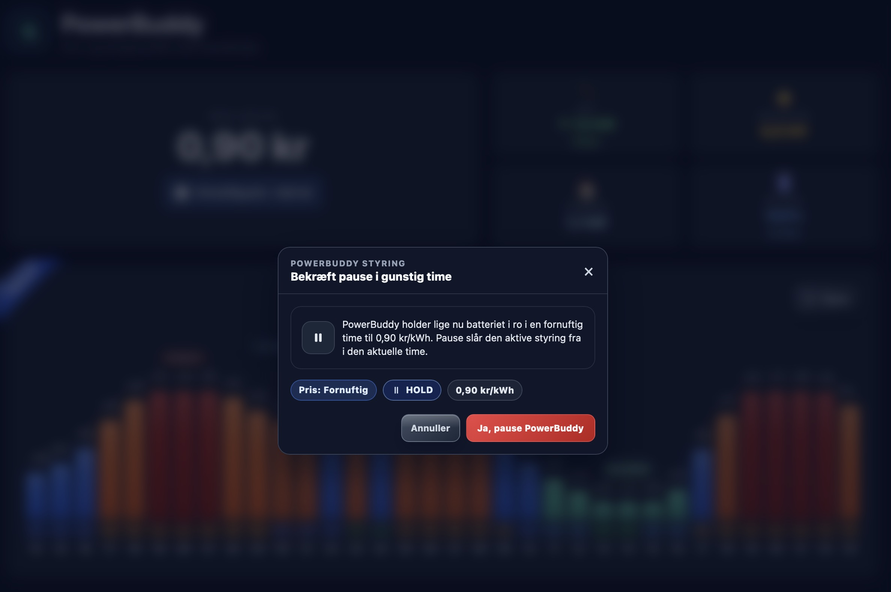
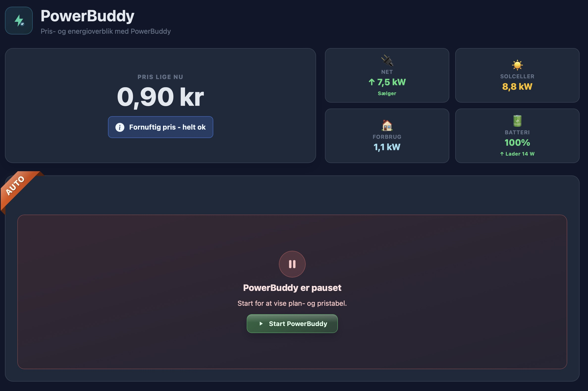

# VNS.PowerBuddy

<p align="left">
  
</p>

VNS.PowerBuddy is a backend service for smart battery and energy planning.

GitHub About (short description):

`Smart home battery optimizer with day-ahead planning, spot-price aware scheduling, and real-time inverter control.`

## Screenshots

<p align="center">
  
  
</p>

<p align="center">
  
  
</p>


Core capabilities:

- Continuously fetches spot prices.
- Reads real-time inverter telemetry (default: Fronius Gen24 API).
- Generates day plans for battery actions (`charge` / `hold` / `discharge`).
- Weather-based PV production forecasting (Open-Meteo cloud/radiation API).
- Seasonal consumption anchoring with configurable monthly reference values.
- Weekday/weekend consumption profiling.
- Multi-scenario robust planning (low/base/high PV and consumption scenarios).
- Battery efficiency and cycle degradation cost modelling.
- Solar capture hold mode — allows PV charging in hold without grid draw.
- Intraday guarded re-planning when consumption deviates from expectations.
- KPI tracking and automatic consumption tuning based on historical accuracy.
- Accurate SOC projection for future-day planning (simulates today's remaining plan).
- Reserve SOC protection windows (configurable hours, e.g. evening peak).
- Stores prices, power snapshots, plans, and simulations in SQLite.
- Supports manual plan overrides through the API.
- Keeps existing day plans stable unless changed manually.
- Includes a native FastAPI dashboard (`/dashboard`) for live overview, plan edits, and execution control.
- Optional Easee EV charger integration with real-time charge state display.

## Compatibility

This release (`v1.0.7`) targets Fronius-based installations and uses Fronius local API endpoints for telemetry/control.

Current status:

- Officially supported: Fronius inverter (Gen24/API-compatible setup).
- Field-tested: Fronius + BYD battery.
- Other battery systems behind Fronius may work but are not verified yet.

If you run a different hardware combination, validate in a test environment before production use.

## Architecture

- `src/powerbuddy/services/pricing.py`: Price provider interface and implementations (`energidataservice`, `elprisenligenu`).
- `src/powerbuddy/services/inverter.py`: Inverter interface and Fronius implementation.
- `src/powerbuddy/services/planner.py`: Planning and simulation engine.
- `src/powerbuddy/repositories.py`: Data access layer.
- `src/powerbuddy/main.py`: FastAPI application and endpoints.
- `src/powerbuddy/services/scheduler.py`: Background jobs (price refresh, snapshots, execution).
- `src/powerbuddy/dashboard_ui.py`: Dashboard HTML rendering and icon/asset injection.
- `src/powerbuddy/services/easee.py`: Optional Easee EV charger integration (token auth, state polling, auto-discovery).

## Quick Start

1. Create a virtual environment and install:

```bash
python3 -m venv .venv
source .venv/bin/activate
pip install -U pip
pip install -e .
```

2. Create your local environment file:

```bash
cp .env.example .env
```

The active runtime config file is `.env` in the project root.

3. Start the API:

```bash
uvicorn powerbuddy.main:app --host 0.0.0.0 --port 8000
```

4. Health check:

```bash
curl http://localhost:8000/health
```

5. Open API docs in your browser:

- `http://localhost:8000/swagger`

## Build And Release

Local run with Makefile:

```bash
make install
make run
```

Build wheel:

```bash
make build
```

Versioning:

- `VERSION` is the release version.
- `pyproject.toml`, `src/powerbuddy/__init__.py`, and the FastAPI app version should stay aligned.
- Dashboard static assets are packaged from `src/powerbuddy/static/`, including nested `css/` and `scripts/` files.

CI:

- GitHub Actions workflow: `.github/workflows/ci.yml`.

## Deployment Model (Production)

The service is intended to run from an installed Python package in a virtual environment, not directly from the `src` tree on the server.

That means:

- Runtime code lives in `.../.venv/lib/pythonX.Y/site-packages/powerbuddy/`.
- Service starts via `uvicorn powerbuddy.main:app` from the venv.
- Server only needs:
  - `/.venv` (runtime + packages)
  - `/data` (SQLite/data files)
  - `/.env` (configuration)

### Apache Reverse Proxy Example

If you want to expose the dashboard under a path like `/powerbuddy` behind Apache, use a reverse proxy to the local FastAPI service.

Example:

```apache
# The main dashboard proxy also covers /powerbuddy/static/*.
ProxyPass /powerbuddy http://127.0.0.1:8000/dashboard nocanon
ProxyPassReverse /powerbuddy http://127.0.0.1:8000/dashboard
```

Notes:

- No, you do not need one `ProxyPass` per dashboard sub-route. `ProxyPass /powerbuddy ...` already works like a wildcard for `/powerbuddy/*` and forwards those requests to `/dashboard/*`.
- With the current setup in this README, the public dashboard assets and icons live under `/powerbuddy/static/...`, which Apache forwards to the app's internal `/dashboard/static/...` mount.
- This keeps Apache config small and avoids separate icon or asset alias rules.

## API Overview

Swagger/OpenAPI:

- `GET /swagger`
- `GET /openapi.json`
- `GET /redoc`

Selected endpoints:

- `GET /`
- `GET /health`
- `GET /config`
- `POST /prices/fetch?target_date=YYYY-MM-DD`
- `GET /prices?target_date=YYYY-MM-DD`
- `GET /prices` (default: current hour + 24 hours ahead)
- `GET /tariff`
- `PUT /tariff/config`
- `PUT /tariff/manual-hours`
- `DELETE /tariff/manual-hours`
- `GET /inverter/realtime`
- `GET /planning?target_date=YYYY-MM-DD`
- `PUT /planning`
- `PUT /planning/action/{action_id}`
- `DELETE /planning/action/{action_id}`
- `POST /planning/override`
- `POST /planning/simulate?target_date=YYYY-MM-DD`
- `GET /planning/now`
- `GET /planning/chart-data?target_date=YYYY-MM-DD`
- `GET /execution/status`
- `POST /execution/pause`
- `POST /execution/start`
- `GET /dashboard`
- `GET /dashboard/state`
- `GET /dashboard/auth/status`
- `POST /dashboard/auth/login`
- `POST /dashboard/auth/logout`
- `POST /dashboard/control`
- `POST /dashboard/planning/action/{action_id}`

## Runtime Configuration

- `GET /config` returns the effective runtime settings loaded from `.env` at startup.
- Runtime config is not updated through database writes or API config persistence.
- Changes in `.env` require a service restart to take effect.
- `.env` is local and should not be committed.

Dashboard access configuration:

- `POWERBUDDY_DASHBOARD_ENABLED`: enables or disables the native dashboard route.
- `POWERBUDDY_DASHBOARD_SECRET`: optional quick-login secret (`/dashboard?secret=...`).
- `POWERBUDDY_DASHBOARD_PASSWORDS`: comma-separated dashboard passwords.
- `POWERBUDDY_DASHBOARD_TRUSTED_IPS`: comma-separated IPs with automatic access.
- `POWERBUDDY_DASHBOARD_SESSION_COOKIE`: dashboard session cookie name.
- `POWERBUDDY_DASHBOARD_SESSION_TTL_SECONDS`: dashboard session lifetime.
- `POWERBUDDY_DASHBOARD_ICON_URL`, `POWERBUDDY_DASHBOARD_FAVICON_URL`, `POWERBUDDY_DASHBOARD_APPLE_TOUCH_ICON_URL`: icon asset paths. Leave empty to use packaged local defaults under `/powerbuddy/static/...`.

Notes:

- The battery overview link on the dashboard is only clickable for logged-in dashboard sessions.
- `.env.example` documents the main runtime knobs; omitted keys continue to use code defaults from `src/powerbuddy/config.py`.

Easee EV charger integration (optional):

- `POWERBUDDY_EASEE_ENABLED`: enable Easee integration (`true`/`false`).
- `POWERBUDDY_EASEE_BASE_URL`: Easee API base URL (default: `https://api.easee.com/api`).
- `POWERBUDDY_EASEE_USERNAME`: Easee account username.
- `POWERBUDDY_EASEE_PASSWORD`: Easee account password.
- `POWERBUDDY_EASEE_CHARGER_ID`: specific charger ID, or leave empty for auto-discovery.

Scheduler behavior:

- Price refresh cadence is controlled by `POWERBUDDY_PRICE_RECHECK_INTERVAL_MINUTES`.
- Day-ahead fetch timing is controlled by `POWERBUDDY_DAY_AHEAD_PUBLISH_HOUR_LOCAL`.
- Planning horizon is controlled by `POWERBUDDY_PLANNING_HORIZON_HOURS` (minimum effective horizon is 48 hours).
- Automatic planning is regenerated only when fetched prices for a day actually change.
- After prices are fetched and unchanged, plans stay locked unless edited manually.

Battery power limits:

- `POWERBUDDY_MAX_CHARGE_KW` and `POWERBUDDY_MAX_DISCHARGE_KW` now accept either a numeric value or `auto`.
- `auto` uses the BYD HVM charge/discharge table based on battery capacity discovered from the inverter at startup: 8.3->4.51 kW, 11.0->5.63 kW, 13.8->6.76 kW, 16.6->7.88 kW, 19.3/22.1->9.01 kW.
- If inverter capacity discovery is unavailable, the fallback profile is HVM 13.8.
- Battery SOC bounds are fixed in code (min 5%, max 100%).
- Legacy keys `POWERBUDDY_BATTERY_CAPACITY_KWH`, `POWERBUDDY_BATTERY_MIN_SOC`, `POWERBUDDY_BATTERY_MAX_SOC`, `POWERBUDDY_PLANNED_CHARGE_KW`, and `POWERBUDDY_DEFAULT_CHARGE_POWER_W` are no longer required.

## Consumption Model

- Base value: `POWERBUDDY_EXPECTED_DAILY_CONSUMPTION_KWH`.
- Dynamic mode: when `POWERBUDDY_DYNAMIC_CONSUMPTION_ENABLED=true`, the planner uses a rolling average of historical daily consumption from `power_snapshots`.
- Lookback window: `POWERBUDDY_DYNAMIC_CONSUMPTION_LOOKBACK_DAYS`.
- Minimum sample requirement per day: `POWERBUDDY_DYNAMIC_CONSUMPTION_MIN_SAMPLES_PER_DAY`.
- Seasonal anchoring: when `POWERBUDDY_SEASONAL_ANCHOR_ENABLED=true`, the dynamic value is blended with a monthly reference (`POWERBUDDY_SEASONAL_ANCHOR_MONTHLY_DAILY_KWH_JSON`).
- Weekday/weekend split: when enabled, separate consumption profiles are used for weekdays vs. weekends.
- PV production: weather-scaled hourly PV profile fetched from Open-Meteo; net consumption (household minus PV) is used in the planner.

## Example: Manual Override

```json
{
  "date": "2026-04-14",
  "start_time": "2026-04-14T16:00:00+02:00",
  "end_time": "2026-04-14T17:00:00+02:00",
  "action": "hold",
  "target_soc": 65,
  "reason": "preserve SOC during peak load"
}
```

## Roadmap

- Expanded tariff/fee handling.
- Profit optimization based on export/import pricing.
- More inverter adapters (Deye, Huawei, Tesla Powerwall, others).
